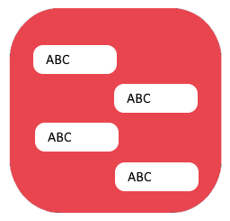

# ChatView Control for MAUI.NET

The `ChatView` control is a highly customizable chat interface for MAUI.NET applications. It supports various features such as displaying messages, handling user interactions, loading more messages, and rendering replies, emojis, and avatars. The control leverages native performance using `RecyclerView` on Android and `UICollectionView` on iOS.

## Build Status


## Installation

You can install the `Indiko.Maui.Controls.Chat` package via NuGet Package Manager or CLI:

[](https://www.nuget.org/packages/Indiko.Maui.Controls.Chat/)

### NuGet Package Manager
```bash
Install-Package Indiko.Maui.Controls.Chat
```

### .NET CLI
```bash
dotnet add package Indiko.Maui.Controls.Chat
```

---

## Features

- **Message Display**: Supports rendering of messages with customizable appearance.
- **Reply Support**: Includes reply-to-message functionality with a preview of the replied message.
- **Emoji Reactions**: Enables users to react to messages with emojis.
- **Avatar Integration**: Displays sender avatars with customizable size and color.
- **Scrollable Chat**: Supports scroll commands and dynamic loading of older messages.
- **Customizable Styling**: Offers extensive styling options for message backgrounds, text colors, font sizes, and more.
- **Event Handling**: Triggers events for message taps, emoji reactions, and load requests.
- **Commands**: Supports binding to commands for key interactions like scrolling, message taps, and loading more messages.
- **Dynamic Separator**: Displays a "New Messages" separator when needed.
- **Native Performance**: Uses `RecyclerView` on Android and `UICollectionView` on iOS for optimized rendering.

---

## Models

### `ChatMessage`
Represents an individual message in the chat.

```csharp
public class ChatMessage
{
    public string MessageId { get; set; }
    public DateTime Timestamp { get; set; }
    public string TextContent { get; set; }
    public byte[] BinaryContent { get; set; }
    public bool IsOwnMessage { get; set; }
    public string SenderId { get; set; }
    public byte[] SenderAvatar { get; set; }
    public string SenderInitials { get; set; }
    public MessageType MessageType { get; set; }
    public MessageReadState ReadState { get; set; }
    public MessageDeliveryState DeliveryState { get; set; }
    public bool IsRepliedMessage => ReplyToMessage != null;
    public RepliedMessage ReplyToMessage { get; set; }
    public List<ChatMessageReaction> Reactions { get; set; } = [];
}
```

### `ChatMessageReaction`
Handles emoji reactions for messages.

```csharp
public class ChatMessageReaction
{
    public string Emoji { get; set; }
    public int Count { get; set; }
    public List<string> ParticipantIds { get; set; } = new List<string>();
}
```

### `RepliedMessage`
Represents a replied message with a text preview.

```csharp
public class RepliedMessage
{
    public string MessageId { get; set; }
    public string TextPreview { get; set; }
    public string SenderId { get; set; }

    public static string GenerateTextPreview(string text, int maxLength = 50)
    {
        if (string.IsNullOrEmpty(text)) return string.Empty;
        return text.Length > maxLength ? text[..maxLength] + "..." : text;
    }
}
```

### Enums
#### `MessageDeliveryState`
- `Sent`
- `Delivered`
- `Read`

#### `MessageReadState`
- `New`
- `Unread`
- `Read`

#### `MessageType`
- `Text`
- `Image`
- `Video`
- `Audio`
- `System`

---

## Installation

Add the ChatView to your MAUI.NET app using the `BuilderExtension`:

```csharp
using Microsoft.Maui.Hosting;
using Indiko.Maui.Controls.Chat;

var builder = MauiApp.CreateBuilder();
builder.UseChatView();
```

---

## Usage

### XAML Example

```xml
<local:ChatView 
    Messages="{Binding Messages}" 
    MessageTappedCommand="{Binding OnMessageTappedCommand}" 
    AvatarTappedCommand="{Binding OnAvatarTappedCommand}" 
    LoadMoreMessagesCommand="{Binding OnLoadMoreMessagesCommand}" 
    OwnMessageBackgroundColor="LightBlue" 
    OtherMessageBackgroundColor="LightGray" 
    MessageFontSize="14"
    ShowNewMessagesSeperator="True"
    NewMessagesSeperatorText="New Messages"/>
```

### Code-Behind Example

```csharp
var chatView = new ChatView
{
    Messages = new ObservableRangeCollection<ChatMessage>(),
    MessageTappedCommand = new Command<ChatMessage>(OnMessageTapped),
    AvatarTappedCommand = new Command(OnAvatarTapped),
    LoadMoreMessagesCommand = new Command(OnLoadMoreMessages),
    OwnMessageBackgroundColor = Colors.LightBlue,
    OtherMessageBackgroundColor = Colors.LightGray,
    ShowNewMessagesSeperator = true,
    NewMessagesSeperatorText = "New Messages"
};

void OnMessageTapped(ChatMessage message)
{
    // Handle message tap
}

void OnAvatarTapped(object sender)
{
    // Handle avatar tap
}

void OnLoadMoreMessages(object sender)
{
    // Handle loading older messages
}
```

---

## Events

- **`MessagesUpdatedEvent`**: Triggered when the `Messages` collection is updated.
- **`LoadMoreMessagesRequested`**: Invoked when older messages should be loaded.
- **`MessageTappedEvent`**: Triggered when a message is tapped.

---

## Styling

The control provides extensive styling options:

| Property                      | Default Value       | Description                                   |
|-------------------------------|---------------------|-----------------------------------------------|
| `OwnMessageBackgroundColor`   | LightBlue           | Background color for the user's messages.     |
| `OtherMessageBackgroundColor` | LightGray           | Background color for other users' messages.   |
| `MessageFontSize`             | 14                 | Font size for message text.                  |
| `DateTextColor`               | LightGray           | Color for date separator text.               |
| `AvatarSize`                  | 36                 | Size of avatars.                             |
| `ScrollToLastMessage`         | true               | Auto-scrolls to the last message.            |

---

## Commands

| Command                    | Description                                              |
|----------------------------|----------------------------------------------------------|
| `ScrolledCommand`          | Invoked when the user scrolls through messages.          |
| `MessageTappedCommand`     | Triggered when a message is tapped.                      |
| `AvatarTappedCommand`      | Triggered when an avatar is tapped.                      |
| `LoadMoreMessagesCommand`  | Invoked when more messages need to be loaded.            |
| `EmojiReactionTappedCommand` | Triggered when an emoji reaction is tapped.            |

---

## Contributing

Contributions to the `ChatView` project are very welcome! Whether you want to add new features, improve existing ones, fix bugs, or enhance documentation, your help is highly appreciated.

---

# How to Contribute

Thank you for considering contributing to our project! Please follow these guidelines to ensure a smooth process.

## 1. Work on a Feature Branch

Always create a new branch for your feature or fix. This keeps the main branch clean and makes it easier to manage changes.

```bash
git checkout -b feature/your-feature-name
```

## 2. Start a Pull Request

Once your feature is complete, push your branch to the repository and start a pull request to merge it into the main branch. Ensure all tests pass and your code follows the project's coding standards.

```bash
git push origin feature/your-feature-name
```

Then, create a pull request on GitHub and provide a clear description of your changes.

## 3. Use Semantic Release Prefixes for Commits

When committing your changes, use semantic release prefixes to categorize your commits. This helps in generating automated release notes and versioning.

The commit contains the following structural elements to communicate intent to the consumers of your library:

- **fix:** a commit of the type fix patches a bug in your codebase (this correlates with PATCH in Semantic Versioning).
- **feat:** a commit of the type feat introduces a new feature to the codebase (this correlates with MINOR in Semantic Versioning).
- **BREAKING CHANGE:** a commit that has a footer BREAKING CHANGE:, or appends a ! after the type/scope, introduces a breaking API change (correlating with MAJOR in Semantic Versioning). A BREAKING CHANGE can be part of commits of any type.
- Types other than fix: and feat: are allowed. For example, @commitlint/config-conventional (based on the Angular convention) recommends:
  - **build:** Changes that affect the build system or external dependencies
  - **chore:** Other changes that don't modify src or test files
  - **ci:** Changes to our CI configuration files and scripts
  - **docs:** Documentation only changes
  - **style:** Changes that do not affect the meaning of the code (white-space, formatting, missing semi-colons, etc)
  - **refactor:** A code change that neither fixes a bug nor adds a feature
  - **perf:** A code change that improves performance
  - **test:** Adding missing tests or correcting existing tests

Footers other than BREAKING CHANGE: <description> may be provided and follow a convention similar to git trailer format. Additional types are not mandated by the Conventional Commits specification and have no implicit effect in Semantic Versioning (unless they include a BREAKING CHANGE). A scope may be provided to a commit’s type, to provide additional contextual information and is contained within parenthesis, e.g., feat(parser): add ability to parse arrays.

Example commit messages:

```bash
git commit -m "fix: resolve issue with user authentication"
git commit -m "feat: add new payment gateway integration"
git commit -m "BREAKING CHANGE: update API endpoints"
```

## 4. Write Meaningful Commit Messages

Commit messages should be concise yet descriptive. They should explain the "what" and "why" of your changes.

- **Good Example:** `fix: correct typo in user profile page`
- **Bad Example:** `fixed stuff`

## Additional Tips

- Ensure your code adheres to the project's coding standards and guidelines.
- Include tests for new features or bug fixes.
- Keep your commits atomic; a single commit should represent a single logical change.
- Update the documentation to reflect any new features or changes.

We appreciate your contributions and look forward to your pull requests!

Happy coding!

---

## License

This project is licensed under the MIT License.