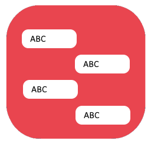

# ChatView Control for MAUI.NET

The `ChatView` control is a highly customizable chat interface for MAUI.NET applications. It supports various features such as displaying messages, handling user interactions, managing replies, emoji reactions, avatars, and system messages. The control is optimized for native performance using platform-specific components like `RecyclerView` on Android and `UICollectionView` on iOS.



## Screenshots

| Android | iOS                |
|--------------|----------------------------|
|  |  |

## Build Status


## Installation

You can install the `Indiko.Maui.Controls.Chat` package via NuGet Package Manager or CLI:

[](https://www.nuget.org/packages/Indiko.Maui.Controls.Chat/)

### NuGet Package Manager
```bash
Install-Package Indiko.Maui.Controls.Chat
```

### .NET CLI
```bash
dotnet add package Indiko.Maui.Controls.Chat
```

---

### Adding to Your Project
To use the ChatView in your project, add the control to your app builder:

```csharp
using Microsoft.Maui.Hosting;
using Indiko.Maui.Controls.Chat;

var builder = MauiApp.CreateBuilder();
builder.UseChatView();
```

---

## Features

- **Message Display**: Renders text, image, video, audio (voice note), system, and date-separator messages.
- **Voice Notes**: Audio messages render as a play/pause button, a tap-to-seek waveform, and an elapsed/total duration label, with native playback on both platforms.
- **Media Bubbles**: Images and videos are sized to the content's aspect ratio (capped) so a photo never blows up the bubble.
- **Media Captions**: Image and video messages can carry a text caption (the message's `TextContent`), shown under the media in the same bubble.
- **Tap-to-Play Video**: Videos show a blurred first-frame poster with a play button; nothing auto-plays while scrolling. Tapping play opens the video **full screen** with native controls (play/pause + seek bar) by default — set `OpenVideoFullScreen="False"` to play inline in the bubble instead.
- **Full-Screen Image Viewer**: Tapping an image opens a full-screen viewer with pinch-to-zoom, pan and double-tap zoom. `MessageTapped` still fires; set `OpenImageFullScreen="False"` to handle the tap yourself.
- **Reply Support**: Reply-to-message functionality with previews of the original message.
- **Tap-to-Jump Reply**: Tapping a message's reply preview scrolls to the original message it replies to and briefly highlights it. Toggle with `EnableJumpToRepliedMessage`; set the flash color with `RepliedMessageHighlightColor` (or `Transparent` to disable it); `RepliedMessageTappedCommand` notifies your view model with the original message.
- **Swipe-to-Reply**: Swipe a bubble to the right to start a reply. It raises the **same** event as the context menu's "Reply" item — `LongPressedCommand` fires with a `ContextAction` (`Name == "reply"`, `Message ==` the swiped message) — so you implement reply logic once for both gestures. The row springs back (haptic on iOS, clamped slide on Android). Toggle with `EnableSwipeToReply`; the action name is configurable via `SwipeReplyActionName`.
- **Emoji Reactions**: Allows emoji reactions with reaction counts and participant details.
- **Avatars**: Displays sender avatars (image or initials) with customizable appearance.
- **Sender Names (group chats)**: Shows `SenderName` above incoming bubbles, de-duplicated for consecutive messages from the same sender. Toggle with `ShowSenderName`; style with `SenderNameTextColor` / `SenderNameFontSize`.
- **Clickable Links**: URLs, phone numbers and email addresses in text messages are detected and tappable (browser / dialer / mail). Toggle with `DetectLinks`; style with `LinkTextColor`. Long-press-to-react still works.
- **Link Previews**: A text message can carry a `LinkPreview` (thumbnail + title + description + site) that renders as an unfurl card under the text; tapping it opens the URL. The control renders only — your app fetches the metadata (keeping the no-networking design) and supplies the thumbnail as bytes. Toggle with `EnableLinkPreview`; style the card via the `LinkPreview*` properties; `LinkPreviewTappedCommand` lets you handle the tap yourself.
- **Date Separators & "New Messages" Separator**: Group messages by day and highlight where unread messages begin.
- **Customizable Styling**: Flexible styling for message backgrounds, text colors, fonts, and more.
- **Commands and Events**: Handles user interactions like taps, emoji reactions, and scrolls.
- **Smart Scrolling**: On iOS the list is rendered with an inverted `UICollectionView`, so the newest message rests at the bottom with no animated jump on open; supports scroll-to-last-message and scroll-to-first-new-message.
- **Scroll-to-Bottom Button**: A floating button appears when the user scrolls away from the newest message; tapping it jumps back to the bottom. An optional badge counts messages that arrive while scrolled up. Fully styleable — toggle with `ShowScrollToBottomButton`; style with `ScrollToBottomButtonBackgroundColor`, `ScrollToBottomButtonIconColor`, `ScrollToBottomButtonSize`, `ScrollToBottomButtonMargin`; the badge with `ShowScrollToBottomBadge`, `ScrollToBottomBadgeBackgroundColor`, `ScrollToBottomBadgeTextColor`, `ScrollToBottomBadgeFontSize`.
- **Load More Messages**: Supports dynamic loading of older messages via a bound command; prepended messages keep the viewport stable.
- **Native Performance**: Uses `RecyclerView` on Android and `UICollectionView` on iOS for smooth performance.
- **Long Press Gesture**: Displays a configured context menu (emoji reactions + actions) on any message — text, image, video and voice note.
- **Optional Composer (`ChatInputView`)**: A separate, fully styleable input control — auto-growing entry, attachments, emoji picker, press-and-hold to record voice notes, reply banner and media preview. Input-only: it raises `SendCommand` with a `ChatComposeResult` so your app stays in charge of persistence/sending. See [Optional message composer](#optional-message-composer-chatinputview).

---

## Requirements

- .NET 10 (`net10.0-android`, `net10.0-ios`)
- Minimum OS: Android 12 (API 31)+ / iOS 14.2+

---

## Supported Message Types

| Message Type | Description                                                                 |
|--------------|-----------------------------------------------------------------------------|
| `Text`       | Standard text messages.                                                     |
| `Image`      | Image messages (PNG/JPEG bytes in `BinaryContent`); aspect-sized bubble.    |
| `Video`      | Video messages (bytes in `BinaryContent`); blurred poster + tap-to-play.     |
| `Audio`      | Voice notes (bytes in `BinaryContent`) with play/pause, waveform, duration. |
| `System`     | System-generated / service messages.                                        |
| `Date`       | Day separator row (usually inserted by your app between date groups).        |

---

## Feature Guide

Every feature with a short example. All snippets assume `ChatMessages` is an
`ObservableRangeCollection<ChatMessage>` bound to `ChatView.Messages`. The
[sample app](samples/) exercises all of these.

> **Tip:** the control is render-only — it has no composer, networking or persistence.
> You build messages in your app and add them to the bound collection.

### Setup

```csharp
// MauiProgram.cs
builder.UseChatView();
```

```xml
xmlns:idk="clr-namespace:Indiko.Maui.Controls.Chat;assembly=Indiko.Maui.Controls.Chat"

<idk:ChatView Messages="{Binding ChatMessages}" />
```

### Binding & updating messages

```csharp
public ObservableRangeCollection<ChatMessage> ChatMessages { get; } = new();

ChatMessages.Add(message);              // single (newest)
ChatMessages.AddRange(initialHistory);  // bulk, one notification
ChatMessages.InsertRange(0, olderPage); // prepend older messages (load-more)
```

### Text, image, video & voice-note messages

```csharp
// Text
new ChatMessage { MessageType = MessageType.Text, TextContent = "Hi!", IsOwnMessage = true, Timestamp = DateTime.Now };

// Image (optional caption via TextContent)
new ChatMessage { MessageType = MessageType.Image, BinaryContent = jpegBytes, TextContent = "from the trail" };

// Video (blurred poster + tap-to-play; full screen by default)
new ChatMessage { MessageType = MessageType.Video, BinaryContent = mp4Bytes };

// Voice note (play/pause + waveform + duration)
new ChatMessage { MessageType = MessageType.Audio, BinaryContent = wavBytes, AudioDuration = TimeSpan.FromSeconds(4) };
```

### System & date-separator messages

```csharp
new ChatMessage { MessageType = MessageType.System, TextContent = "Messages are end-to-end encrypted" };
new ChatMessage { MessageType = MessageType.Date, Timestamp = day, TextContent = day.ToString("dddd, MMMM d, yyyy") };
```

### Avatars & sender names (group chats)

```csharp
msg.SenderAvatar = avatarPngBytes;   // image avatar, or…
msg.SenderInitials = "AB";           // …initials fallback
msg.SenderName = "Alex Berg";        // shown above incoming bubbles, de-duplicated per run
```

```xml
<idk:ChatView ShowSenderName="True" SenderNameTextColor="MediumPurple" SenderNameFontSize="12"
              AvatarSize="36" AvatarBackgroundColor="Indigo" AvatarTextColor="White" />
```

### Emoji reactions

```csharp
msg.Reactions.Add(new ChatMessageReaction { Emoji = "👍", Count = 3, ParticipantIds = ["u1", "u2", "u3"] });
```

```xml
<idk:ChatView EmojiReactionFontSize="14" EmojiReactionTextColor="Indigo"
              EmojiReactionTappedCommand="{Binding ReactionTappedCommand}" />
```

### Replies, swipe-to-reply & tap-to-jump

```csharp
// Render a reply preview inside a bubble
msg.ReplyToMessage = new RepliedMessage
{
    MessageId   = original.MessageId,
    SenderId    = "Alex Berg",
    TextPreview = RepliedMessage.GenerateTextPreview(original.TextContent)
};
```

```xml
<idk:ChatView EnableSwipeToReply="True"
              EnableJumpToRepliedMessage="True"
              RepliedMessageHighlightColor="#80FFD54F"
              LongPressedCommand="{Binding LongPressedCommand}" />
```

Swiping a bubble **and** the context menu's "Reply" item raise the same event, so you handle reply once:

```csharp
[RelayCommand]
void LongPressed(ContextAction action)
{
    if (action.Name == "reply")
        StartReplyTo(action.Message); // your composer sets the next message's ReplyToMessage
}
```

Tapping a reply preview scrolls to (and flashes) the original; `RepliedMessageTappedCommand` also fires with that message.

### Link previews (URL unfurl cards)

```csharp
// Your app fetches the metadata + thumbnail bytes; the control only renders the card.
msg.LinkPreview = new LinkPreview
{
    Url = "https://learn.microsoft.com/dotnet/maui/",
    SiteName = "learn.microsoft.com",
    Title = ".NET MAUI documentation",
    Description = "Build cross-platform native apps from one C# codebase.",
    ImageBytes = thumbnailBytes
};
```

```xml
<idk:ChatView EnableLinkPreview="True"
              LinkPreviewBackgroundColor="#F2F2F2"
              LinkPreviewTitleColor="Black"
              LinkPreviewSiteNameColor="RoyalBlue"
              LinkPreviewTappedCommand="{Binding LinkPreviewTappedCommand}" />
```

### Clickable links (URLs / phone / email)

```xml
<idk:ChatView DetectLinks="True" LinkTextColor="RoyalBlue" />
```

### Delivery & read state (with custom icons)

```csharp
msg.DeliveryState = MessageDeliveryState.Read; // Sent | Delivered | Read
msg.ReadState     = MessageReadState.New;       // New | Unread | Read
```

```xml
<idk:ChatView SendIcon="send.png" DeliveredIcon="check.png" ReadIcon="read.png" />
```

### "New messages" separator

```xml
<idk:ChatView ShowNewMessagesSeperator="True"
              NewMessagesSeperatorText="New Messages"
              NewMessagesSeperatorTextColor="Indigo"
              ScrollToFirstNewMessage="True" />
```

### Load more (infinite scroll up)

```xml
<idk:ChatView LoadMoreMessagesCommand="{Binding LoadOlderCommand}" />
```

```csharp
[RelayCommand]
void LoadOlder() => ChatMessages.InsertRange(0, await GetOlderPageAsync()); // viewport stays stable
```

### Scroll-to-bottom button + unread badge

```xml
<idk:ChatView ShowScrollToBottomButton="True"
              ScrollToBottomButtonBackgroundColor="{StaticResource Primary}"
              ScrollToBottomButtonIconColor="White"
              ScrollToBottomButtonSize="46"
              ShowScrollToBottomBadge="True"
              ScrollToBottomBadgeBackgroundColor="Red"
              ScrollToBottomBadgeTextColor="White" />
```

The button appears while scrolled up; the badge counts messages that arrive meanwhile. Tapping it returns to the newest message and clears the badge.

### Full-screen media

```xml
<!-- defaults: both true. Set false to keep media inline / handle the tap yourself. -->
<idk:ChatView OpenImageFullScreen="True" OpenVideoFullScreen="True" />
```

### Context menu (long press) — actions + reactions

```csharp
chatView.ContextMenuItems =
[
    new() { Name = "Copy",  Tag = "copy" },
    new() { Name = "Reply", Tag = "reply" },
    new() { Name = "Delete", Tag = "delete", IsDestructive = true },
];
chatView.EmojiReactions = ["👍", "❤️", "😂", "🔥"];
```

```csharp
[RelayCommand]
void LongPressed(ContextAction action)
{
    switch (action.Name)
    {
        case "react":  var reaction = (ChatMessageReaction)action.AdditionalData; /* add to message */ break;
        case "copy":   Clipboard.SetTextAsync(action.Message.TextContent); break;
        case "reply":  StartReplyTo(action.Message); break;
        case "delete": ChatMessages.Remove(action.Message); break;
    }
}
```

```xml
<idk:ChatView EnableContextMenu="True"
              ContextMenuBackgroundColor="White" ContextMenuTextColor="Gray"
              ContextMenuDestructiveTextColor="Red" ContextMenuReactionFontSize="18" />
```

---

## Optional message composer (`ChatInputView`)

`ChatView` is render-only and ships no input box, so you can build your own. For convenience the
library also includes an **optional**, fully styleable composer — `ChatInputView` — that you place
below the `ChatView`. It provides an auto-growing text entry, attachments (built-in `MediaPicker`),
an emoji picker, **press-and-hold to record voice notes** (built-in), a reply banner and a selected-media preview.

Like everything else it is **input-only**: it never persists or sends. On send it raises
`SendCommand` with a `ChatComposeResult`; your app builds the `ChatMessage` (persisting / sending as
it sees fit) and adds it to the bound collection.

> **Recording a voice note:** the mic shows when the entry is empty. **Press and hold** it to record,
> **release** to send, or **slide off** the mic to cancel.

```xml
<Grid RowDefinitions="*, Auto">
    <idk:ChatView Grid.Row="0" Messages="{Binding ChatMessages}" />

    <idk:ChatInputView Grid.Row="1"
        Placeholder="Type a message..."
        AccentColor="{StaticResource Primary}"
        EntryBackgroundColor="#F0F0F0"
        EnableAttachments="True"
        EnableVoiceRecording="True"
        EnableEmojiPicker="True"
        ReplyingTo="{Binding ReplyingTo, Mode=TwoWay}"
        SendCommand="{Binding SendComposedCommand}" />
</Grid>
```

```csharp
[RelayCommand]
void SendComposed(ChatComposeResult result)
{
    if (result is null || result.IsEmpty) return;

    ChatMessages.Add(new ChatMessage
    {
        TextContent    = result.Text,
        BinaryContent  = result.MediaBytes,
        MessageType    = result.MediaType ?? MessageType.Text, // Image / Video / Audio / Text
        AudioDuration  = result.AudioDuration,
        IsOwnMessage   = true,
        Timestamp      = DateTime.Now,
        MessageId      = Guid.NewGuid().ToString(),
        ReplyToMessage = result.ReplyingTo is null ? null : new RepliedMessage
        {
            MessageId   = result.ReplyingTo.MessageId,
            SenderId    = result.ReplyingTo.SenderName,
            TextPreview = RepliedMessage.GenerateTextPreview(result.ReplyingTo.TextContent)
        }
    });
}
```

Binding `ReplyingTo` two-way connects the composer to the swipe / context-menu **reply** flow: when
the user starts a reply, set `ReplyingTo` on your VM and the composer shows a reply banner; it clears
it on send (or when the user taps ✕).

**Customization** — colors, font sizes, feature toggles and **icons** are all bindable. Icons accept
any `ImageSource` (PNG/SVG/`FontImageSource`) and fall back to built-in glyphs when unset:

```xml
<idk:ChatInputView AccentColor="Indigo" TextColor="Black" PlaceholderColor="Gray"
                   EntryBackgroundColor="#EFEFEF" InputFontSize="16" IconFontSize="18"
                   ReplyBarBackgroundColor="#ECECEC" ReplyBarTextColor="Black">
    <idk:ChatInputView.SendIcon>
        <FontImageSource Glyph="{x:Static utils:FontAwesome.Paperplane}"
                         FontFamily="{x:Static utils:FontAwesome.FONTNAME}" Color="Indigo" Size="20" />
    </idk:ChatInputView.SendIcon>
</idk:ChatInputView>
```

| Property | Default | Description |
|----------|---------|-------------|
| `Text` | "" | Two-way composer text. |
| `Placeholder` | "Type a message…" | Entry placeholder. |
| `SendCommand` | – | Raised with a `ChatComposeResult` on send. |
| `ClearOnSend` | true | Clear text/media/reply after `SendCommand`. |
| `ReplyingTo` | null | Two-way; shows the reply banner when set. |
| `SelectedMedia` | null | Two-way attached media bytes (preview shown). |
| `EnableAttachments` / `EnableVoiceRecording` / `EnableEmojiPicker` | true | Toggle each feature. |
| `EmojiList` | built-in set | Emojis shown in the picker. |
| `AccentColor` | RoyalBlue | Tint for icons + reply accent. |
| `TextColor` / `PlaceholderColor` / `EntryBackgroundColor` | Black / Gray / #F0F0F0 | Entry styling. |
| `ReplyBarBackgroundColor` / `ReplyBarTextColor` | #ECECEC / Black | Reply banner styling. |
| `InputFontSize` / `IconFontSize` | 16 / 18 | Text and glyph-icon sizes. |
| `SendIcon` / `AttachIcon` / `MicIcon` / `EmojiIcon` | built-in glyphs | Custom `ImageSource` icons. |

> **Permissions (built-in attachments & recording):** add `RECORD_AUDIO` to the Android manifest, and
> `NSMicrophoneUsageDescription` + `NSPhotoLibraryUsageDescription` to the iOS `Info.plist`. Prefer to
> handle media/recording yourself? Set `EnableAttachments`/`EnableVoiceRecording` to `False` and add
> your own buttons that set `SelectedMedia` / call your `SendCommand`.

---

## Models

### `ChatMessage`
Represents an individual message in the chat.

```csharp
public class ChatMessage
{
    public string MessageId { get; set; }
    public DateTime Timestamp { get; set; }
    public string TextContent { get; set; }
    public byte[] BinaryContent { get; set; }          // image / video / audio payload
    public bool IsOwnMessage { get; set; }
    public string SenderId { get; set; }
    public byte[] SenderAvatar { get; set; }
    public string SenderInitials { get; set; }
    public string SenderName { get; set; }        // shown above incoming bubbles in group chats
    public MessageType MessageType { get; set; }
    public MessageReadState ReadState { get; set; }
    public MessageDeliveryState DeliveryState { get; set; }
    public bool IsRepliedMessage => ReplyToMessage != null;
    public RepliedMessage ReplyToMessage { get; set; }
    public List<ChatMessageReaction> Reactions { get; set; } = [];

    // Audio (voice note) — both optional.
    public TimeSpan? AudioDuration { get; set; }       // shown while idle; derived from the file if null
    public float[] AudioWaveform { get; set; }         // normalized 0..1 samples; a stable
                                                       // pseudo-waveform is generated when null
}
```

### `ChatMessageReaction`
Represents reactions (emojis) on a message.

```csharp
public class ChatMessageReaction
{
    public string Emoji { get; set; }
    public int Count { get; set; }
    public List<string> ParticipantIds { get; set; } = new List<string>();
}
```

### `RepliedMessage`
Represents a replied message with a preview.

```csharp
public class RepliedMessage
{
    public string MessageId { get; set; }
    public string TextPreview { get; set; }
    public string SenderId { get; set; }

    public static string GenerateTextPreview(string text, int maxLength = 50)
    {
        if (string.IsNullOrEmpty(text)) return string.Empty;
        return text.Length > maxLength ? text[..maxLength] + "..." : text;
    }
}
```

### `LinkPreview`
Data for a link-preview ("unfurl") card under a text message. Your app fetches the URL's metadata and supplies it; the control only renders it.

```csharp
public class LinkPreview
{
    public string Url { get; set; }          // opened when the card is tapped
    public string Title { get; set; }        // e.g. og:title
    public string Description { get; set; }  // e.g. og:description
    public string SiteName { get; set; }     // e.g. "github.com"
    public byte[] ImageBytes { get; set; }   // optional thumbnail bytes
}
```

### `ChatComposeResult`
The payload raised by `ChatInputView.SendCommand`. Your app turns it into a `ChatMessage`.

```csharp
public class ChatComposeResult
{
    public string Text { get; set; }
    public byte[] MediaBytes { get; set; }       // attached media or recorded audio
    public MessageType? MediaType { get; set; }  // Image / Video / Audio, or null for text
    public TimeSpan? AudioDuration { get; set; } // set for recorded voice notes
    public ChatMessage ReplyingTo { get; set; }  // reply target, if any
    public bool IsEmpty { get; }                 // true when there's nothing to send
}
```

### `ContextMenuItem`
Represents an item in the context menu.

```csharp
public class ContextMenuItem
{
    public string Name { get; set; }
    public string Tag { get; set; }
    public bool IsDestructive { get; set; }
}
```

### `ContextAction`
Represents an action triggered from the context menu.

```csharp
public class ContextAction
{
    public string Name { get; set; }
    public object AdditionalData { get; set; }
    public ChatMessage Message { get; set; }
}
```

### Enums

#### `MessageDeliveryState`
- `Sent`
- `Delivered`
- `Read`

#### `MessageReadState`
- `New`
- `Unread`
- `Read`

#### `MessageType`
- `Text`
- `Image`
- `Video`
- `Audio`
- `System`
- `Date`

---

## Commands

| Command                          | Description                                                    |
|----------------------------------|----------------------------------------------------------------|
| `ScrolledCommand`                | Triggered when the chat view is scrolled. See example below.   |
| `MessageTappedCommand`           | Triggered when a message is tapped.                           |
| `AvatarTappedCommand`            | Triggered when an avatar is tapped.                           |
| `EmojiReactionTappedCommand`     | Triggered when an emoji reaction is tapped.                   |
| `LoadMoreMessagesCommand`        | Invoked when more messages need to be loaded.                 |
| `ScrolledToLastMessageCommand`   | Triggered when scrolled to the last message.                  |
| `LongPressedCommand`             | Triggered by a context-menu action **and** by swipe-to-reply; receives a `ContextAction` (`Name`, `Message`). Swipe sends `Name == "reply"`. |
| `RepliedMessageTappedCommand`    | Triggered when a reply preview is tapped; passes the original `ChatMessage` it refers to. |
| `LinkPreviewTappedCommand`       | Triggered when a link-preview card is tapped; passes the `LinkPreview`. When unset, the card opens its `Url`. |

---

## Styling

| Property                         | Default Value       | Description                                       |
|----------------------------------|---------------------|---------------------------------------------------|
| `SystemMessageBackgroundColor`   | LightYellow         | Background color for system messages.            |
| `SystemMessageTextColor`         | Red                | Text color for system messages.                 |
| `SystemMessageFontSize`          | 14                 | Font size for system messages.                  |
| `DateTextFontSize`               | 14                 | Font size for date separator text.              |
| `DateTextColor`                  | LightGray           | Color for date separator text.                   |
| `AvatarBackgroundColor`          | LightBlue           | Background color for avatars.                   |
| `AvatarTextColor`                | White              | Text color for avatar initials.                 |
| `OwnMessageBackgroundColor`      | LightBlue           | Background color for the user's messages.         |
| `OwnMessageTextColor`            | Black              | Text color for the user's messages.              |
| `OwnMessageFontSize`             | 14                 | Font size for the user's messages.               |
| `OtherMessageBackgroundColor`    | LightGray           | Background color for other users' messages.       |
| `OtherMessageTextColor`          | Black              | Text color for other users' messages.            |
| `OtherMessageFontSize`           | 14                 | Font size for other users' messages.             |
| `MessageFontSize`                | 14                 | Font size for messages.                          |
| `DateTextColor`                  | LightGray           | Color for date separator text.                   |
| `AvatarSize`                     | 36                 | Size of avatars.                                 |
| `ScrollToLastMessage`            | true               | Auto-scrolls to the last message.                |
| `ShowNewMessagesSeperator`       | false              | Enables or disables the new message separator.   |
| `EmojiReactionFontSize`          | 10                 | Font size for emoji reactions.                   |
| `ReplyMessageBackgroundColor`    | LightYellow         | Background color for replied message previews.   |
| `ReplyMessageFontSize`           | 10                 | Font size for replied message previews.          |
| `ReplyMessageTextColor`          | Black              | Text color for replied message previews.         |
| `ContextMenuBackgroundColor`     | White              | Background color for the context menu.           |
| `ContextMenuTextColor`           | Black              | Text color for the context menu.                 |
| `ContextMenuDestructiveTextColor`| Red                | Text color for destructive actions in the context menu. |
| `ContextMenuDividerColor`        | LightGray           | Color for the context menu divider.              |
| `ContextMenuDividerHeight`       | 1                  | Height of the context menu divider.              |
| `ContextMenuFontSize`            | 14                 | Font size for the context menu.                  |
| `ContextMenuReactionFontSize`    | 18                 | Font size for reaction items in the context menu.|
| `ShowScrollToBottomButton`       | true               | Shows the floating scroll-to-bottom button when scrolled up. |
| `ScrollToBottomButtonBackgroundColor` | White         | Fill color of the scroll-to-bottom button.       |
| `ScrollToBottomButtonIconColor`  | Black              | Color of the chevron icon.                       |
| `ScrollToBottomButtonSize`       | 44                 | Diameter of the scroll-to-bottom button.         |
| `ScrollToBottomButtonMargin`     | 16                 | Spacing from the bottom/trailing edges.          |
| `ShowScrollToBottomBadge`        | true               | Shows the unread-count badge on the button.      |
| `ScrollToBottomBadgeBackgroundColor` | Red            | Fill color of the unread-count badge.            |
| `ScrollToBottomBadgeTextColor`   | White              | Text color of the unread-count badge.            |
| `ScrollToBottomBadgeFontSize`    | 12                 | Font size of the unread-count badge.             |
| `EnableJumpToRepliedMessage`     | true               | Tapping a reply preview scrolls to the original message. |
| `RepliedMessageHighlightColor`   | translucent amber  | Color flashed over the original message on jump (Transparent disables it). |
| `EnableLinkPreview`              | true               | Render the link-preview card for text messages that carry a `LinkPreview`. |
| `LinkPreviewBackgroundColor`     | #F2F2F2            | Fill color of the link-preview card.             |
| `LinkPreviewTitleColor`          | Black              | Color of the card title.                         |
| `LinkPreviewTitleFontSize`       | 14                 | Font size of the card title.                     |
| `LinkPreviewDescriptionColor`    | Gray               | Color of the card description.                    |
| `LinkPreviewDescriptionFontSize` | 12                 | Font size of the card description.               |
| `LinkPreviewSiteNameColor`       | RoyalBlue          | Color of the card site/domain label.             |
| `LinkPreviewSiteNameFontSize`    | 11                 | Font size of the card site/domain label.         |

---

## Usage

> **Platform-Specific Note:** The platform-specific code for iOS and Android uses a caching mechanism for images and video-based messages. The binary content of such messages is stored in the device's cache folder for optimized performance and memory management.

> **Note:** The `ChatView` control is solely responsible for rendering different message types. It does not include features like a text input box or a send button. These components need to be implemented by the user in the MAUI.NET app, as demonstrated in the `Indiko.Maui.Controls.Chat.Sample` project.

### Managing the `Messages` Collection

`Messages` is an `ObservableRangeCollection<ChatMessage>` — an `ObservableCollection` with bulk operations so large updates raise a single notification (important for scroll performance):

```csharp
ChatMessages.Add(message);                 // append a new (newest) message
ChatMessages.AddRange(newMessages);        // append many at once
ChatMessages.InsertRange(0, olderMessages);// prepend older messages (infinite-scroll load-more)
ChatMessages.ReplaceRange(allMessages);    // replace the whole conversation
```

Use `InsertRange(0, ...)` from your `LoadMoreMessagesCommand` handler to add older history; the control keeps the current viewport stable instead of jumping.

### Sending Images and Voice Notes

Media is passed as raw bytes in `BinaryContent` together with the matching `MessageType`. The control writes the bytes to the platform cache and renders/plays them natively.

```csharp
// Image
ChatMessages.Add(new ChatMessage
{
    MessageId = Guid.NewGuid().ToString(),
    Timestamp = DateTime.Now,
    IsOwnMessage = true,
    MessageType = MessageType.Image,
    BinaryContent = imageBytes,            // PNG/JPEG
    TextContent = "optional caption",      // shown under the image in the same bubble
});

// Voice note
ChatMessages.Add(new ChatMessage
{
    MessageId = Guid.NewGuid().ToString(),
    Timestamp = DateTime.Now,
    IsOwnMessage = true,
    MessageType = MessageType.Audio,
    BinaryContent = audioBytes,            // e.g. m4a / mp3 / wav
    AudioDuration = TimeSpan.FromSeconds(3), // optional; derived from the file if omitted
    AudioWaveform = samples,               // optional float[] (0..1); a pseudo-waveform is drawn if omitted
});
```

The voice-note bubble shows a play/pause button, a tap-to-seek waveform, and the elapsed/total duration. Supply `AudioWaveform` (e.g. amplitudes captured while recording) for an accurate waveform; otherwise the control renders a stable per-message pseudo-waveform.

### Emoji Reaction Tapped Event Handling Example

To handle the `EmojiReactionTappedCommand` properly, you can define a method in your ViewModel as follows:

```csharp
[RelayCommand]
private void OnEmojiReactionTapped(ChatMessage message)
{
    Console.WriteLine($"Emoji Reaction tapped: {message.MessageId}");
}
```

### Message Clicked Event Handling Example

To handle the `MessageTappedCommand` properly, you can define a method in your ViewModel as follows:

```csharp
[RelayCommand]
private void OnMessageTapped(ChatMessage message)
{
    Console.WriteLine($"Message tapped for message: {message.MessageId}");
}
```

### Avatar Clicked Event Handling Example

To handle the `AvatarTappedCommand` properly, you can define a method in your ViewModel as follows:

```csharp
[RelayCommand]
private void OnAvatarTapped(ChatMessage message)
{
    Console.WriteLine($"Avatar tapped for message: {message.MessageId}");
}
```

### Scrolled Event Handling Example

To handle the `ScrolledCommand` properly, you can define a method in your ViewModel as follows:

```csharp
[RelayCommand]
private void Scrolled(ScrolledArgs scrolledArgs)
{
    // Handle scroll event logic
    Console.WriteLine($"Scrolled to position: X={scrolledArgs.X}, Y={scrolledArgs.Y}");
}
```

### Long Press Gesture Event Handling Example

To handle the `LongPressedCommand` properly, you can define a method in your ViewModel as follows:

```csharp
[RelayCommand]
public void LongPressed(ContextAction contextAction)
{
    switch (contextAction.Name)
    {
        case "reply":
            Console.WriteLine($"Reply to message: {contextAction.Message.MessageId}");
            break;
        case "delete":
            Console.WriteLine($"Delete message: {contextAction.Message.MessageId}");
            break;
        case "copy":
            Console.WriteLine($"Copy message: {contextAction.Message.MessageId}");
            break;
        case "react":
            ChatMessageReaction chatMessageReaction = contextAction.AdditionalData as ChatMessageReaction;
            Console.WriteLine($"React to message: {contextAction.Message.MessageId}, Additional Data: {chatMessageReaction.Emoji}");
            break;
    }
}
```

### XAML Example

```xml
xmlns:idk="clr-namespace:Indiko.Maui.Controls.Chat;assembly=Indiko.Maui.Controls.Chat"
...

<idk:ChatView Grid.Row="0" x:Name="chatView"

    OwnMessageBackgroundColor="{StaticResource Primary}"
    OwnMessageTextColor="{StaticResource White}"
    OtherMessageBackgroundColor="{StaticResource Secondary}"
    OtherMessageTextColor="{StaticResource Black}"
    DateTextColor="{StaticResource Gray500}"
    DateTextFontSize="14"
    MessageTimeTextColor="{StaticResource Gray200}"
    NewMessagesSeperatorTextColor="{StaticResource Primary}"
    NewMessagesSeperatorFontSize="16"
    NewMessagesSeperatorText="New Messages"
    AvatarTextColor="{StaticResource White}"
    AvatarBackgroundColor="{StaticResource Tertiary}"
    Messages="{Binding ChatMessages}"
    EmojiReactionFontSize="14"
    EmojiReactionTextColor="{StaticResource Primary}"
    ReplyMessageBackgroundColor="{StaticResource Tertiary}"
    ReplyMessageTextColor="{StaticResource White}"
    LoadMoreMessagesCommand="{Binding LoadOlderMessagesCommand}"
    ScrolledCommand="{Binding ScrolledCommand}"
    AvatarTappedCommand="{Binding AvatarTappedCommand}"
    MessageTappedCommand="{Binding MessageTappedCommand}"
    EmojiReactionTappedCommand="{Binding EmojiReactionTappedCommand}"
    SendIcon="send.png"
    DeliveredIcon="check.png"
    ReadIcon="read.png"
    ScrollToFirstNewMessage="True"
    ShowNewMessagesSeperator="True"
    ScrolledToLastMessageCommand="{Binding ScrolledToLastMessageCommand}"
    SystemMessageBackgroundColor="{StaticResource Yellow300Accent}"
    SystemMessageTextColor="{StaticResource Tertiary}"
    SystemMessageFontSize="14"
    ContextMenuBackgroundColor="{StaticResource White}"
    ContextMenuTextColor="{StaticResource Black}"
    ContextMenuDestructiveTextColor="{StaticResource Red}"
    ContextMenuDividerColor="{StaticResource LightGray}"
    ContextMenuDividerHeight="1"
    ContextMenuFontSize="14"
    ContextMenuReactionFontSize="18"
    EnableContextMenu="True"
    LongPressedCommand="{Binding LongPressedCommand}">

</idk:ChatView>
```

### Code-Behind Example

```csharp
var chatView = new ChatView
{
    Messages = new ObservableRangeCollection<ChatMessage>(),
    MessageTappedCommand = new Command<ChatMessage>(OnMessageTapped),
    AvatarTappedCommand = new Command(OnAvatarTapped),
    LoadMoreMessagesCommand = new Command(OnLoadMoreMessages),
    OwnMessageBackgroundColor = Colors.LightBlue,
    OtherMessageBackgroundColor = Colors.LightGray,
    ShowNewMessagesSeperator = true,
    NewMessagesSeperatorText = "New Messages",
    ContextMenuItems = new List<ContextMenuItem>
    {
        new() { Name = "Copy", Tag = "copy" },
        new() { Name = "Reply", Tag = "reply" },
        new() { Name = "Delete", Tag = "delete", IsDestructive = true },
    },
    LongPressedCommand = new Command<ContextAction>(OnLongPressed)
};

void OnMessageTapped(ChatMessage message)
{
    // Handle message tap
}

void OnAvatarTapped()
{
    // Handle avatar tap
}

void OnLoadMoreMessages()
{
    // Load older messages
}

void OnLongPressed(ContextAction contextAction)
{
    // Handle long press actions
}
```

---

## Documentation

Comprehensive technical documentation for all types, methods, and properties is available in the [`/docs`](docs/) folder. The documentation is auto-generated from the codebase using Roslyn analysis.

### Quick Links

- **[Documentation Index](docs/index.md)** — Start here for an overview
- **[API Reference](docs/classes/)** — Browse all classes and types
- **[Namespace Overview](docs/namespaces/)** — Organized by namespace
- **[Architecture Diagrams](docs/index.md#diagrams)** — Class hierarchy and dependencies

### Features

- 📚 Complete API reference for all public types
- 🔗 Cross-referenced type links
- 📊 Mermaid diagrams for visualization
- 📝 XML documentation comments included
- 🔄 Version controlled alongside code

### Regenerating Documentation

After making code changes, regenerate the documentation:

```bash
dotnet run --project tools/Tools.CodeDocGenerator/Tools.CodeDocGenerator.csproj
```

See the [documentation guide](docs/README.md) for more details.

---

## Contributing

We encourage you to contribute to the development of the `ChatView` control! Whether you're fixing bugs, adding new features, or enhancing the documentation, your contributions make a difference.

If you find the `ChatView` control helpful, please consider leaving a ⭐ on the repository. It helps others discover this project and shows your support!

Contributions are welcome! Please follow the guidelines for creating feature branches, writing commit messages, and submitting pull requests.

---

# How to Contribute

Thank you for considering contributing to our project! Please follow these guidelines to ensure a smooth process.

## 1. Work on a Feature Branch

Always create a new branch for your feature or fix. This keeps the main branch clean and makes it easier to manage changes.

```bash
git checkout -b feature/your-feature-name
```

## 2. Start a Pull Request

Once your feature is complete, push your branch to the repository and start a pull request to merge it into the main branch. Ensure all tests pass and your code follows the project's coding standards.

```bash
git push origin feature/your-feature-name
```

Then, create a pull request on GitHub and provide a clear description of your changes.

## 3. Use Semantic Release Prefixes for Commits

When committing your changes, use semantic release prefixes to categorize your commits. This helps in generating automated release notes and versioning.

The commit contains the following structural elements to communicate intent to the consumers of your library:

- **fix:** a commit of the type fix patches a bug in your codebase (this correlates with PATCH in Semantic Versioning).
- **feat:** a commit of the type feat introduces a new feature to the codebase (this correlates with MINOR in Semantic Versioning).
- **BREAKING CHANGE:** a commit that has a footer BREAKING CHANGE:, or appends a ! after the type/scope, introduces a breaking API change (correlating with MAJOR in Semantic Versioning). A BREAKING CHANGE can be part of commits of any type.
- Types other than fix: and feat: are allowed. For example, @commitlint/config-conventional (based on the Angular convention) recommends:
  - **build:** Changes that affect the build system or external dependencies
  - **chore:** Other changes that don't modify src or test files
  - **ci:** Changes to our CI configuration files and scripts
  - **docs:** Documentation only changes
  - **style:** Changes that do not affect the meaning of the code (white-space, formatting, missing semi-colons, etc)
  - **refactor:** A code change that neither fixes a bug nor adds a feature
  - **perf:** A code change that improves performance
  - **test:** Adding missing tests or correcting existing tests

Footers other than BREAKING CHANGE: <description> may be provided and follow a convention similar to git trailer format. Additional types are not mandated by the Conventional Commits specification and have no implicit effect in Semantic Versioning (unless they include a BREAKING CHANGE). A scope may be provided to a commit’s type, to provide additional contextual information and is contained within parenthesis, e.g., feat(parser): add ability to parse arrays.

Example commit messages:

```bash
git commit -m "fix: resolve issue with user authentication"
git commit -m "feat: add new payment gateway integration"
git commit -m "BREAKING CHANGE: update API endpoints"
```

## 4. Write Meaningful Commit Messages

Commit messages should be concise yet descriptive. They should explain the "what" and "why" of your changes.

- **Good Example:** `fix: correct typo in user profile page`
- **Bad Example:** `fixed stuff`

## Additional Tips

- Ensure your code adheres to the project's coding standards and guidelines.
- Include tests for new features or bug fixes.
- Keep your commits atomic; a single commit should represent a single logical change.
- Update the documentation to reflect any new features or changes.

We appreciate your contributions and look forward to your pull requests!

Happy coding!

---

## License

This project is licensed under the MIT License.

---

This updated documentation includes the new properties and functionality for the long press gesture feature, ensuring that users understand how to configure and use the context menu for chat message actions.