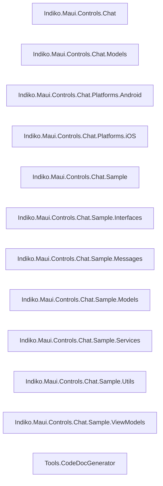

# Code Documentation Index

**Generated:** 2025-10-23 05:54:47 UTC

## Overview

| Metric | Count |
|--------|-------|
| Total Types | 67 |
| Namespaces | 12 |
| Classes | 61 |
| Interfaces | 2 |
| Structs | 0 |
| Enums | 4 |
| Records | 0 |
| Methods | 184 |
| Properties | 160 |

## Diagrams

### Class Hierarchy

```mermaid
graph TD
    ContentPage["ContentPage"] --> Indiko_Maui_Controls_Chat_Sample_MainPage["MainPage"]
    Shell["Shell"] --> Indiko_Maui_Controls_Chat_Sample_AppShell["AppShell"]
    Application["Application"] --> Indiko_Maui_Controls_Chat_Sample_App["App"]
    View["View"] --> Indiko_Maui_Controls_Chat_ChatView["ChatView"]
    Indiko_Maui_Controls_Chat_Sample_Services_IMessageService["IMessageService"] -.-> Indiko_Maui_Controls_Chat_Sample_Services_MessageService["MessageService"]
    ValueChangedMessage_System_DateTime_["DateTime>"] --> Indiko_Maui_Controls_Chat_Sample_Messages_HideKeyboardMessage["HideKeyboardMessage"]
    BaseViewModel["BaseViewModel"] --> Indiko_Maui_Controls_Chat_Sample_ViewModels_MainPageViewModel["MainPageViewModel"]
    ObservableObject["ObservableObject"] --> Indiko_Maui_Controls_Chat_Sample_ViewModels_BaseViewModel["BaseViewModel"]
    IViewModel["IViewModel"] -.-> Indiko_Maui_Controls_Chat_Sample_ViewModels_BaseViewModel["BaseViewModel"]
    ObservableCollection_T_["ObservableCollection<T>"] --> Indiko_Maui_Controls_Chat_Models_ObservableRangeCollection_T_["ObservableRangeCollection"]
    MauiUIApplicationDelegate["MauiUIApplicationDelegate"] --> Indiko_Maui_Controls_Chat_Sample_AppDelegate["AppDelegate"]
    MauiApplication["MauiApplication"] --> Indiko_Maui_Controls_Chat_Sample_MainApplication["MainApplication"]
    MauiAppCompatActivity["MauiAppCompatActivity"] --> Indiko_Maui_Controls_Chat_Sample_MainActivity["MainActivity"]
    UICollectionViewCell["UICollectionViewCell"] --> Indiko_Maui_Controls_Chat_Platforms_iOS_DateGroupSeperatorCell["DateGroupSeperatorCell"]
    UIView["UIView"] --> Indiko_Maui_Controls_Chat_Platforms_iOS_ChatContextMenuView["ChatContextMenuView"]
    UICollectionViewCell["UICollectionViewCell"] --> Indiko_Maui_Controls_Chat_Platforms_iOS_OtherVideoMessageCell["OtherVideoMessageCell"]
    UICollectionViewCell["UICollectionViewCell"] --> Indiko_Maui_Controls_Chat_Platforms_iOS_OwnAudioMessageCell["OwnAudioMessageCell"]
    UICollectionViewCell["UICollectionViewCell"] --> Indiko_Maui_Controls_Chat_Platforms_iOS_OwnImageMessageCell["OwnImageMessageCell"]
    UICollectionViewDiffableDataSource_Indiko_Maui_Controls_Chat_Platforms_iOS_ChatSection__Indiko_Maui_Controls_Chat_Platforms_iOS_ChatMessageItem_["ChatMessageItem>"] --> Indiko_Maui_Controls_Chat_Platforms_iOS_ChatViewDataSource["ChatViewDataSource"]
    NSObject["NSObject"] --> Indiko_Maui_Controls_Chat_Platforms_iOS_ChatSection["ChatSection"]
    NSObject["NSObject"] --> Indiko_Maui_Controls_Chat_Platforms_iOS_ChatMessageItem["ChatMessageItem"]
    ViewHandler_ChatView__UICollectionView_["ViewHandler<ChatView, UICollectionView>"] --> Indiko_Maui_Controls_Chat_Platforms_iOS_ChatViewHandler["ChatViewHandler"]
    UICollectionViewCell["UICollectionViewCell"] --> Indiko_Maui_Controls_Chat_Platforms_iOS_OwnVideoMessageCell["OwnVideoMessageCell"]
    UICollectionViewDelegateFlowLayout["UICollectionViewDelegateFlowLayout"] --> Indiko_Maui_Controls_Chat_Platforms_iOS_ChatViewDelegate["ChatViewDelegate"]
    UICollectionViewCell["UICollectionViewCell"] --> Indiko_Maui_Controls_Chat_Platforms_iOS_OtherTextMessageCell["OtherTextMessageCell"]
    UICollectionViewFlowLayout["UICollectionViewFlowLayout"] --> Indiko_Maui_Controls_Chat_Platforms_iOS_ChatViewFlowLayout["ChatViewFlowLayout"]
    UICollectionViewCell["UICollectionViewCell"] --> Indiko_Maui_Controls_Chat_Platforms_iOS_OtherAudioMessageCell["OtherAudioMessageCell"]
    UICollectionViewCell["UICollectionViewCell"] --> Indiko_Maui_Controls_Chat_Platforms_iOS_OwnTextMessageCell["OwnTextMessageCell"]
    UICollectionViewCell["UICollectionViewCell"] --> Indiko_Maui_Controls_Chat_Platforms_iOS_OtherImageMessageCell["OtherImageMessageCell"]
    UICollectionViewCell["UICollectionViewCell"] --> Indiko_Maui_Controls_Chat_Platforms_iOS_SystemMessageCell["SystemMessageCell"]
    RecyclerView_Adapter["Adapter"] --> Indiko_Maui_Controls_Chat_Platforms_Android_ChatMessageAdapter["ChatMessageAdapter"]
    RecyclerView_OnScrollListener["OnScrollListener"] --> Indiko_Maui_Controls_Chat_Platforms_Android_OnScrollListener["OnScrollListener"]
    FrameLayout["FrameLayout"] --> Indiko_Maui_Controls_Chat_Platforms_Android_BlurOverlayView["BlurOverlayView"]
    ViewHandler_ChatView__RecyclerView_["ViewHandler<ChatView, RecyclerView>"] --> Indiko_Maui_Controls_Chat_Platforms_Android_ChatViewHandler["ChatViewHandler"]
    RecyclerView_ViewHolder["ViewHolder"] --> Indiko_Maui_Controls_Chat_Platforms_Android_ChatMessageViewHolder["ChatMessageViewHolder"]
    IDisposable["IDisposable"] -.-> Indiko_Maui_Controls_Chat_Platforms_Android_ChatMessageViewHolder["ChatMessageViewHolder"]
    RecyclerView_ItemDecoration["ItemDecoration"] --> Indiko_Maui_Controls_Chat_Platforms_Android_SpacingItemDecoration["SpacingItemDecoration"]
```

### Namespace Dependencies

## Namespaces

### [Indiko.Maui.Controls.Chat](namespaces/Indiko.Maui.Controls.Chat.md)

Contains 3 type(s)

- 🔷 [BuilderExtension](classes/Indiko.Maui.Controls.Chat.BuilderExtension.md) — Class
- 🔷 [ChatView](classes/Indiko.Maui.Controls.Chat.ChatView.md) — Class
- 🔷 [ScrolledArgs](classes/Indiko.Maui.Controls.Chat.ScrolledArgs.md) — Class

### [Indiko.Maui.Controls.Chat.Models](namespaces/Indiko.Maui.Controls.Chat.Models.md)

Contains 9 type(s)

- 🔷 [ChatMessage](classes/Indiko.Maui.Controls.Chat.Models.ChatMessage.md) — Class
- 🔷 [ChatMessageReaction](classes/Indiko.Maui.Controls.Chat.Models.ChatMessageReaction.md) — Class
- 🔷 [ContextAction](classes/Indiko.Maui.Controls.Chat.Models.ContextAction.md) — Class
- 🔷 [ContextMenuItem](classes/Indiko.Maui.Controls.Chat.Models.ContextMenuItem.md) — Class
- 🔹 [MessageDeliveryState](classes/Indiko.Maui.Controls.Chat.Models.MessageDeliveryState.md) — Enum
- 🔹 [MessageReadState](classes/Indiko.Maui.Controls.Chat.Models.MessageReadState.md) — Enum
- 🔹 [MessageType](classes/Indiko.Maui.Controls.Chat.Models.MessageType.md) — Enum
- 🔷 [ObservableRangeCollection](classes/Indiko.Maui.Controls.Chat.Models.ObservableRangeCollection_T_.md) — Class
- 🔷 [RepliedMessage](classes/Indiko.Maui.Controls.Chat.Models.RepliedMessage.md) — Class

### [Indiko.Maui.Controls.Chat.Platforms.Android](namespaces/Indiko.Maui.Controls.Chat.Platforms.Android.md)

Contains 9 type(s)

- 🔷 [BitmapUtils](classes/Indiko.Maui.Controls.Chat.Platforms.Android.BitmapUtils.md) — Class
- 🔷 [BlurHelper](classes/Indiko.Maui.Controls.Chat.Platforms.Android.BlurHelper.md) — Class
- 🔷 [BlurOverlayView](classes/Indiko.Maui.Controls.Chat.Platforms.Android.BlurOverlayView.md) — Class
- 🔷 [ChatMessageAdapter](classes/Indiko.Maui.Controls.Chat.Platforms.Android.ChatMessageAdapter.md) — Class
- 🔷 [ChatMessageViewHolder](classes/Indiko.Maui.Controls.Chat.Platforms.Android.ChatMessageViewHolder.md) — Class
- 🔷 [ChatViewHandler](classes/Indiko.Maui.Controls.Chat.Platforms.Android.ChatViewHandler.md) — Class
- 🔷 [OnScrollListener](classes/Indiko.Maui.Controls.Chat.Platforms.Android.OnScrollListener.md) — Class
- 🔷 [PixelExtensions](classes/Indiko.Maui.Controls.Chat.Platforms.Android.PixelExtensions.md) — Class
- 🔷 [SpacingItemDecoration](classes/Indiko.Maui.Controls.Chat.Platforms.Android.SpacingItemDecoration.md) — Class

### [Indiko.Maui.Controls.Chat.Platforms.iOS](namespaces/Indiko.Maui.Controls.Chat.Platforms.iOS.md)

Contains 20 type(s)

- 🔷 [ChatContextMenuView](classes/Indiko.Maui.Controls.Chat.Platforms.iOS.ChatContextMenuView.md) — Class
- 🔷 [ChatMessageItem](classes/Indiko.Maui.Controls.Chat.Platforms.iOS.ChatMessageItem.md) — Class
- 🔷 [ChatSection](classes/Indiko.Maui.Controls.Chat.Platforms.iOS.ChatSection.md) — Class
- 🔷 [ChatViewDataSource](classes/Indiko.Maui.Controls.Chat.Platforms.iOS.ChatViewDataSource.md) — Class
- 🔷 [ChatViewDelegate](classes/Indiko.Maui.Controls.Chat.Platforms.iOS.ChatViewDelegate.md) — Class
- 🔷 [ChatViewFlowLayout](classes/Indiko.Maui.Controls.Chat.Platforms.iOS.ChatViewFlowLayout.md) — Class
- 🔷 [ChatViewHandler](classes/Indiko.Maui.Controls.Chat.Platforms.iOS.ChatViewHandler.md) — Class
- 🔷 [DateGroupSeperatorCell](classes/Indiko.Maui.Controls.Chat.Platforms.iOS.DateGroupSeperatorCell.md) — Class
- 🔷 [EmojiHelper](classes/Indiko.Maui.Controls.Chat.Platforms.iOS.EmojiHelper.md) — Class
- 🔷 [OtherAudioMessageCell](classes/Indiko.Maui.Controls.Chat.Platforms.iOS.OtherAudioMessageCell.md) — Class
- 🔷 [OtherImageMessageCell](classes/Indiko.Maui.Controls.Chat.Platforms.iOS.OtherImageMessageCell.md) — Class
- 🔷 [OtherTextMessageCell](classes/Indiko.Maui.Controls.Chat.Platforms.iOS.OtherTextMessageCell.md) — Class
- 🔷 [OtherVideoMessageCell](classes/Indiko.Maui.Controls.Chat.Platforms.iOS.OtherVideoMessageCell.md) — Class
- 🔷 [OwnAudioMessageCell](classes/Indiko.Maui.Controls.Chat.Platforms.iOS.OwnAudioMessageCell.md) — Class
- 🔷 [OwnImageMessageCell](classes/Indiko.Maui.Controls.Chat.Platforms.iOS.OwnImageMessageCell.md) — Class
- 🔷 [OwnTextMessageCell](classes/Indiko.Maui.Controls.Chat.Platforms.iOS.OwnTextMessageCell.md) — Class
- 🔷 [OwnVideoMessageCell](classes/Indiko.Maui.Controls.Chat.Platforms.iOS.OwnVideoMessageCell.md) — Class
- 🔷 [SystemMessageCell](classes/Indiko.Maui.Controls.Chat.Platforms.iOS.SystemMessageCell.md) — Class
- 🔷 [UIImageExtensions](classes/Indiko.Maui.Controls.Chat.Platforms.iOS.UIImageExtensions.md) — Class
- 🔷 [UiViewExtensions](classes/Indiko.Maui.Controls.Chat.Platforms.iOS.UiViewExtensions.md) — Class

### [Indiko.Maui.Controls.Chat.Sample](namespaces/Indiko.Maui.Controls.Chat.Sample.md)

Contains 10 type(s)

- 🔷 [App](classes/Indiko.Maui.Controls.Chat.Sample.App.md) — Class
- 🔷 [AppDelegate](classes/Indiko.Maui.Controls.Chat.Sample.AppDelegate.md) — Class
- 🔷 [AppDelegate](classes/Indiko.Maui.Controls.Chat.Sample.AppDelegate.md) — Class
- 🔷 [AppShell](classes/Indiko.Maui.Controls.Chat.Sample.AppShell.md) — Class
- 🔷 [MainActivity](classes/Indiko.Maui.Controls.Chat.Sample.MainActivity.md) — Class
- 🔷 [MainApplication](classes/Indiko.Maui.Controls.Chat.Sample.MainApplication.md) — Class
- 🔷 [MainPage](classes/Indiko.Maui.Controls.Chat.Sample.MainPage.md) — Class
- 🔷 [MauiProgram](classes/Indiko.Maui.Controls.Chat.Sample.MauiProgram.md) — Class
- 🔷 [Program](classes/Indiko.Maui.Controls.Chat.Sample.Program.md) — Class
- 🔷 [Program](classes/Indiko.Maui.Controls.Chat.Sample.Program.md) — Class

### [Indiko.Maui.Controls.Chat.Sample.Interfaces](namespaces/Indiko.Maui.Controls.Chat.Sample.Interfaces.md)

Contains 1 type(s)

- 🔶 [IViewModel](classes/Indiko.Maui.Controls.Chat.Sample.Interfaces.IViewModel.md) — Interface

### [Indiko.Maui.Controls.Chat.Sample.Messages](namespaces/Indiko.Maui.Controls.Chat.Sample.Messages.md)

Contains 1 type(s)

- 🔷 [HideKeyboardMessage](classes/Indiko.Maui.Controls.Chat.Sample.Messages.HideKeyboardMessage.md) — Class

### [Indiko.Maui.Controls.Chat.Sample.Models](namespaces/Indiko.Maui.Controls.Chat.Sample.Models.md)

Contains 1 type(s)

- 🔷 [User](classes/Indiko.Maui.Controls.Chat.Sample.Models.User.md) — Class

### [Indiko.Maui.Controls.Chat.Sample.Services](namespaces/Indiko.Maui.Controls.Chat.Sample.Services.md)

Contains 2 type(s)

- 🔶 [IMessageService](classes/Indiko.Maui.Controls.Chat.Sample.Services.IMessageService.md) — Interface
- 🔷 [MessageService](classes/Indiko.Maui.Controls.Chat.Sample.Services.MessageService.md) — Class

### [Indiko.Maui.Controls.Chat.Sample.Utils](namespaces/Indiko.Maui.Controls.Chat.Sample.Utils.md)

Contains 2 type(s)

- 🔷 [EmbeddedResourceHelper](classes/Indiko.Maui.Controls.Chat.Sample.Utils.EmbeddedResourceHelper.md) — Class
- 🔷 [FontAwesome](classes/Indiko.Maui.Controls.Chat.Sample.Utils.FontAwesome.md) — Class

### [Indiko.Maui.Controls.Chat.Sample.ViewModels](namespaces/Indiko.Maui.Controls.Chat.Sample.ViewModels.md)

Contains 2 type(s)

- 🔷 [BaseViewModel](classes/Indiko.Maui.Controls.Chat.Sample.ViewModels.BaseViewModel.md) — Class
- 🔷 [MainPageViewModel](classes/Indiko.Maui.Controls.Chat.Sample.ViewModels.MainPageViewModel.md) — Class

### [Tools.CodeDocGenerator](namespaces/Tools.CodeDocGenerator.md)

Contains 7 type(s)

- 🔷 [AttributeInfo](classes/Tools.CodeDocGenerator.AttributeInfo.md) — Class
- 🔷 [CodeAnalyzer](classes/Tools.CodeDocGenerator.CodeAnalyzer.md) — Class
- 🔷 [MarkdownGenerator](classes/Tools.CodeDocGenerator.MarkdownGenerator.md) — Class
- 🔷 [MemberInfo](classes/Tools.CodeDocGenerator.MemberInfo.md) — Class
- 🔷 [ParameterInfo](classes/Tools.CodeDocGenerator.ParameterInfo.md) — Class
- 🔷 [TypeInfo](classes/Tools.CodeDocGenerator.TypeInfo.md) — Class
- 🔹 [TypeKind](classes/Tools.CodeDocGenerator.TypeKind.md) — Enum

## All Types (Alphabetical)

- [App](classes/Indiko.Maui.Controls.Chat.Sample.App.md) — `Indiko.Maui.Controls.Chat.Sample` (Class)
- [AppDelegate](classes/Indiko.Maui.Controls.Chat.Sample.AppDelegate.md) — `Indiko.Maui.Controls.Chat.Sample` (Class)
- [AppDelegate](classes/Indiko.Maui.Controls.Chat.Sample.AppDelegate.md) — `Indiko.Maui.Controls.Chat.Sample` (Class)
- [AppShell](classes/Indiko.Maui.Controls.Chat.Sample.AppShell.md) — `Indiko.Maui.Controls.Chat.Sample` (Class)
- [AttributeInfo](classes/Tools.CodeDocGenerator.AttributeInfo.md) — `Tools.CodeDocGenerator` (Class)
- [BaseViewModel](classes/Indiko.Maui.Controls.Chat.Sample.ViewModels.BaseViewModel.md) — `Indiko.Maui.Controls.Chat.Sample.ViewModels` (Class)
- [BitmapUtils](classes/Indiko.Maui.Controls.Chat.Platforms.Android.BitmapUtils.md) — `Indiko.Maui.Controls.Chat.Platforms.Android` (Class)
- [BlurHelper](classes/Indiko.Maui.Controls.Chat.Platforms.Android.BlurHelper.md) — `Indiko.Maui.Controls.Chat.Platforms.Android` (Class)
- [BlurOverlayView](classes/Indiko.Maui.Controls.Chat.Platforms.Android.BlurOverlayView.md) — `Indiko.Maui.Controls.Chat.Platforms.Android` (Class)
- [BuilderExtension](classes/Indiko.Maui.Controls.Chat.BuilderExtension.md) — `Indiko.Maui.Controls.Chat` (Class)
- [ChatContextMenuView](classes/Indiko.Maui.Controls.Chat.Platforms.iOS.ChatContextMenuView.md) — `Indiko.Maui.Controls.Chat.Platforms.iOS` (Class)
- [ChatMessage](classes/Indiko.Maui.Controls.Chat.Models.ChatMessage.md) — `Indiko.Maui.Controls.Chat.Models` (Class)
- [ChatMessageAdapter](classes/Indiko.Maui.Controls.Chat.Platforms.Android.ChatMessageAdapter.md) — `Indiko.Maui.Controls.Chat.Platforms.Android` (Class)
- [ChatMessageItem](classes/Indiko.Maui.Controls.Chat.Platforms.iOS.ChatMessageItem.md) — `Indiko.Maui.Controls.Chat.Platforms.iOS` (Class)
- [ChatMessageReaction](classes/Indiko.Maui.Controls.Chat.Models.ChatMessageReaction.md) — `Indiko.Maui.Controls.Chat.Models` (Class)
- [ChatMessageViewHolder](classes/Indiko.Maui.Controls.Chat.Platforms.Android.ChatMessageViewHolder.md) — `Indiko.Maui.Controls.Chat.Platforms.Android` (Class)
- [ChatSection](classes/Indiko.Maui.Controls.Chat.Platforms.iOS.ChatSection.md) — `Indiko.Maui.Controls.Chat.Platforms.iOS` (Class)
- [ChatView](classes/Indiko.Maui.Controls.Chat.ChatView.md) — `Indiko.Maui.Controls.Chat` (Class)
- [ChatViewDataSource](classes/Indiko.Maui.Controls.Chat.Platforms.iOS.ChatViewDataSource.md) — `Indiko.Maui.Controls.Chat.Platforms.iOS` (Class)
- [ChatViewDelegate](classes/Indiko.Maui.Controls.Chat.Platforms.iOS.ChatViewDelegate.md) — `Indiko.Maui.Controls.Chat.Platforms.iOS` (Class)
- [ChatViewFlowLayout](classes/Indiko.Maui.Controls.Chat.Platforms.iOS.ChatViewFlowLayout.md) — `Indiko.Maui.Controls.Chat.Platforms.iOS` (Class)
- [ChatViewHandler](classes/Indiko.Maui.Controls.Chat.Platforms.iOS.ChatViewHandler.md) — `Indiko.Maui.Controls.Chat.Platforms.iOS` (Class)
- [ChatViewHandler](classes/Indiko.Maui.Controls.Chat.Platforms.Android.ChatViewHandler.md) — `Indiko.Maui.Controls.Chat.Platforms.Android` (Class)
- [CodeAnalyzer](classes/Tools.CodeDocGenerator.CodeAnalyzer.md) — `Tools.CodeDocGenerator` (Class)
- [ContextAction](classes/Indiko.Maui.Controls.Chat.Models.ContextAction.md) — `Indiko.Maui.Controls.Chat.Models` (Class)
- [ContextMenuItem](classes/Indiko.Maui.Controls.Chat.Models.ContextMenuItem.md) — `Indiko.Maui.Controls.Chat.Models` (Class)
- [DateGroupSeperatorCell](classes/Indiko.Maui.Controls.Chat.Platforms.iOS.DateGroupSeperatorCell.md) — `Indiko.Maui.Controls.Chat.Platforms.iOS` (Class)
- [EmbeddedResourceHelper](classes/Indiko.Maui.Controls.Chat.Sample.Utils.EmbeddedResourceHelper.md) — `Indiko.Maui.Controls.Chat.Sample.Utils` (Class)
- [EmojiHelper](classes/Indiko.Maui.Controls.Chat.Platforms.iOS.EmojiHelper.md) — `Indiko.Maui.Controls.Chat.Platforms.iOS` (Class)
- [FontAwesome](classes/Indiko.Maui.Controls.Chat.Sample.Utils.FontAwesome.md) — `Indiko.Maui.Controls.Chat.Sample.Utils` (Class)
- [HideKeyboardMessage](classes/Indiko.Maui.Controls.Chat.Sample.Messages.HideKeyboardMessage.md) — `Indiko.Maui.Controls.Chat.Sample.Messages` (Class)
- [IMessageService](classes/Indiko.Maui.Controls.Chat.Sample.Services.IMessageService.md) — `Indiko.Maui.Controls.Chat.Sample.Services` (Interface)
- [IViewModel](classes/Indiko.Maui.Controls.Chat.Sample.Interfaces.IViewModel.md) — `Indiko.Maui.Controls.Chat.Sample.Interfaces` (Interface)
- [MainActivity](classes/Indiko.Maui.Controls.Chat.Sample.MainActivity.md) — `Indiko.Maui.Controls.Chat.Sample` (Class)
- [MainApplication](classes/Indiko.Maui.Controls.Chat.Sample.MainApplication.md) — `Indiko.Maui.Controls.Chat.Sample` (Class)
- [MainPage](classes/Indiko.Maui.Controls.Chat.Sample.MainPage.md) — `Indiko.Maui.Controls.Chat.Sample` (Class)
- [MainPageViewModel](classes/Indiko.Maui.Controls.Chat.Sample.ViewModels.MainPageViewModel.md) — `Indiko.Maui.Controls.Chat.Sample.ViewModels` (Class)
- [MarkdownGenerator](classes/Tools.CodeDocGenerator.MarkdownGenerator.md) — `Tools.CodeDocGenerator` (Class)
- [MauiProgram](classes/Indiko.Maui.Controls.Chat.Sample.MauiProgram.md) — `Indiko.Maui.Controls.Chat.Sample` (Class)
- [MemberInfo](classes/Tools.CodeDocGenerator.MemberInfo.md) — `Tools.CodeDocGenerator` (Class)
- [MessageDeliveryState](classes/Indiko.Maui.Controls.Chat.Models.MessageDeliveryState.md) — `Indiko.Maui.Controls.Chat.Models` (Enum)
- [MessageReadState](classes/Indiko.Maui.Controls.Chat.Models.MessageReadState.md) — `Indiko.Maui.Controls.Chat.Models` (Enum)
- [MessageService](classes/Indiko.Maui.Controls.Chat.Sample.Services.MessageService.md) — `Indiko.Maui.Controls.Chat.Sample.Services` (Class)
- [MessageType](classes/Indiko.Maui.Controls.Chat.Models.MessageType.md) — `Indiko.Maui.Controls.Chat.Models` (Enum)
- [ObservableRangeCollection](classes/Indiko.Maui.Controls.Chat.Models.ObservableRangeCollection_T_.md) — `Indiko.Maui.Controls.Chat.Models` (Class)
- [OnScrollListener](classes/Indiko.Maui.Controls.Chat.Platforms.Android.OnScrollListener.md) — `Indiko.Maui.Controls.Chat.Platforms.Android` (Class)
- [OtherAudioMessageCell](classes/Indiko.Maui.Controls.Chat.Platforms.iOS.OtherAudioMessageCell.md) — `Indiko.Maui.Controls.Chat.Platforms.iOS` (Class)
- [OtherImageMessageCell](classes/Indiko.Maui.Controls.Chat.Platforms.iOS.OtherImageMessageCell.md) — `Indiko.Maui.Controls.Chat.Platforms.iOS` (Class)
- [OtherTextMessageCell](classes/Indiko.Maui.Controls.Chat.Platforms.iOS.OtherTextMessageCell.md) — `Indiko.Maui.Controls.Chat.Platforms.iOS` (Class)
- [OtherVideoMessageCell](classes/Indiko.Maui.Controls.Chat.Platforms.iOS.OtherVideoMessageCell.md) — `Indiko.Maui.Controls.Chat.Platforms.iOS` (Class)
- [OwnAudioMessageCell](classes/Indiko.Maui.Controls.Chat.Platforms.iOS.OwnAudioMessageCell.md) — `Indiko.Maui.Controls.Chat.Platforms.iOS` (Class)
- [OwnImageMessageCell](classes/Indiko.Maui.Controls.Chat.Platforms.iOS.OwnImageMessageCell.md) — `Indiko.Maui.Controls.Chat.Platforms.iOS` (Class)
- [OwnTextMessageCell](classes/Indiko.Maui.Controls.Chat.Platforms.iOS.OwnTextMessageCell.md) — `Indiko.Maui.Controls.Chat.Platforms.iOS` (Class)
- [OwnVideoMessageCell](classes/Indiko.Maui.Controls.Chat.Platforms.iOS.OwnVideoMessageCell.md) — `Indiko.Maui.Controls.Chat.Platforms.iOS` (Class)
- [ParameterInfo](classes/Tools.CodeDocGenerator.ParameterInfo.md) — `Tools.CodeDocGenerator` (Class)
- [PixelExtensions](classes/Indiko.Maui.Controls.Chat.Platforms.Android.PixelExtensions.md) — `Indiko.Maui.Controls.Chat.Platforms.Android` (Class)
- [Program](classes/Indiko.Maui.Controls.Chat.Sample.Program.md) — `Indiko.Maui.Controls.Chat.Sample` (Class)
- [Program](classes/Indiko.Maui.Controls.Chat.Sample.Program.md) — `Indiko.Maui.Controls.Chat.Sample` (Class)
- [RepliedMessage](classes/Indiko.Maui.Controls.Chat.Models.RepliedMessage.md) — `Indiko.Maui.Controls.Chat.Models` (Class)
- [ScrolledArgs](classes/Indiko.Maui.Controls.Chat.ScrolledArgs.md) — `Indiko.Maui.Controls.Chat` (Class)
- [SpacingItemDecoration](classes/Indiko.Maui.Controls.Chat.Platforms.Android.SpacingItemDecoration.md) — `Indiko.Maui.Controls.Chat.Platforms.Android` (Class)
- [SystemMessageCell](classes/Indiko.Maui.Controls.Chat.Platforms.iOS.SystemMessageCell.md) — `Indiko.Maui.Controls.Chat.Platforms.iOS` (Class)
- [TypeInfo](classes/Tools.CodeDocGenerator.TypeInfo.md) — `Tools.CodeDocGenerator` (Class)
- [TypeKind](classes/Tools.CodeDocGenerator.TypeKind.md) — `Tools.CodeDocGenerator` (Enum)
- [UIImageExtensions](classes/Indiko.Maui.Controls.Chat.Platforms.iOS.UIImageExtensions.md) — `Indiko.Maui.Controls.Chat.Platforms.iOS` (Class)
- [UiViewExtensions](classes/Indiko.Maui.Controls.Chat.Platforms.iOS.UiViewExtensions.md) — `Indiko.Maui.Controls.Chat.Platforms.iOS` (Class)
- [User](classes/Indiko.Maui.Controls.Chat.Sample.Models.User.md) — `Indiko.Maui.Controls.Chat.Sample.Models` (Class)
